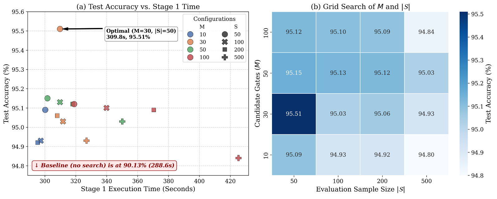

# Hyperparameter Configuration Analysis

This document provides the detailed hyperparameter experiments for QLogicNet, which are summarized only briefly in the paper.

## 1. Purpose

The hyperparameter study was conducted to determine the main structural settings of QLogicNet while balancing classification accuracy, search cost, and hardware efficiency. The main factors considered were:

- the number of QLO layers,
- the input encoding partitioning scheme, and
- the random search parameters, including the number of candidate QLOs \(M\) and the scoring subset size \(|\mathcal{S}|\).

## 2. Impact of Network Depth

We evaluated QLogicNet with different numbers of QLO layers. The results showed that performance did not improve monotonically with increasing depth.

- A single-layer network had insufficient expressive power for complex nonlinear patterns.
- When the number of QLO layers exceeded two, the accuracy began to decrease.

This degradation is likely caused by the rapidly enlarged discrete search space and the accumulation of noise during multi-layer logic propagation. Therefore, a two-layer QLO architecture was adopted in the paper.

## 3. Input Encoding Partitioning Scheme

For MNIST, we compared three partitioning schemes for \(2\times2\) local patches:

- horizontal,
- vertical,
- diagonal.

Among them, vertical partitioning achieved the best classification accuracy. Therefore, vertical partitioning was used as the default image encoding scheme in all subsequent experiments.

## 4. Candidate Gates and Scoring Subset Size

We further studied the trade-off between accuracy and Stage 1 execution time under different values of \(M\) and \(|\mathcal{S}|\), where:

- \(M\): number of candidate QLOs sampled for each neuron,
- \(|\mathcal{S}|\): size of the sampled subset used for candidate evaluation.

The baseline setting without the search phase required 288.6 s for feature extraction and achieved 90.13% test accuracy. With the proposed lightweight search strategy, the best configuration was obtained at:

- \(M=30\)
- \(|\mathcal{S}|=50\)

Under this setting, the search overhead was 21.2 s, and the final test accuracy reached 95.51%.

When \(M\) or \(|\mathcal{S}|\) was further increased, the performance gain became marginal and could even degrade slightly. For example, using \(M=100\) or \(|\mathcal{S}|=500\) reduced the final test accuracy to 94.84%. This suggests that overly aggressive search may overfit the lightweight scoring procedure and generalize less effectively in later layers.

Therefore, \(M=30\) and \(|\mathcal{S}|=50\) were used in all experiments reported in the paper.

## 5. Final Hyperparameter Choices Used in the Paper

The final settings adopted in the paper are:

- Number of QLO layers: 2
- Partitioning scheme for image inputs: vertical
- Number of candidate QLOs per neuron: \(M=30\)
- Scoring subset size: \(|\mathcal{S}|=50\)

## 6. Figures

- Fig. 2: impact of partitioning schemes and network depth
- Fig. 3: trade-off between test accuracy and Stage 1 execution time under different \(M\) and \(|\mathcal{S}|\)

